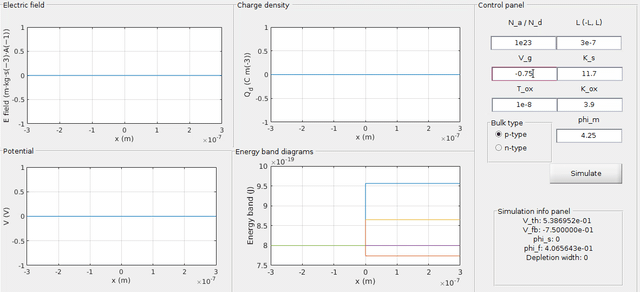

# GUI-visualizer-MOS

This is a GUI simulator for MOS capacitors. Following is the demo for the same. 



### Instructions

1. To run the code:

```matlab
% Execute the following in matlab terminal.
% Switch directory to src
cd src
% Run the simulator
simulator
```


### Contributor

Rahul Sajnani

